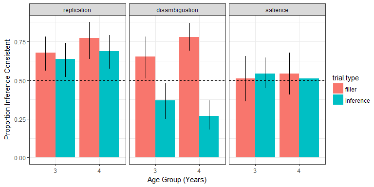

Twitter Challenge
================
Tristan Mahr
November 4, 2016

In response to this challenge... <https://twitter.com/annemscheel/status/794578875615498240>

Original
========

``` r
# run data prep script
source("./analysis/info_e4_ana.R")
#> Warning: package 'bootstrap' was built under R version 3.3.2
#> Loading required package: Matrix
#> 
#> Attaching package: 'lme4'
#> The following object is masked from 'package:stats':
#> 
#>     sigma
```

Try to reproduce the original plot with 2016-2017 ggplot2 code.

``` r
# original plot (basically)
ggplot(mss) +
  aes(x = age_group, y = correct, fill = trial.type) +
  stat_summary(geom = "bar", fun.y = mean, position = position_dodge(.9)) + 
  stat_summary(geom = "linerange", fun.data = mean_cl_boot, 
               position = position_dodge(.9)) +
  geom_hline(yintercept = .5, lty = 2) +
  labs(x = "Age Group (Years)", y = "Proportion Inference Consistent") +
  facet_wrap("expt")
```



Show mean-error over raw data.

``` r
ggplot(mss) +
  aes(x = age_group, y = correct, color = trial.type, fill = trial.type) +
  geom_hline(yintercept = .5, lty = 2) +
  geom_point(position = position_jitterdodge(dodge.width = .9, jitter.width = .20, 
                                             jitter.height = .05), 
             alpha = .3) + 
  stat_summary(position = position_dodge(.9), fun.data = mean_cl_boot, size = .9) + 
  labs(x = "Age Group (Years)", y = "Proportion Inference Consistent") +
  facet_wrap("expt") + 
  labs(caption = "Mean +/- 95% bootstrap CI")
```


I didn't realize that there were only four trials per child x trial-type, so only 5 values possible along y-axis. In this case, the points don't do much besides illustrate how many points go into the mean.

Plot but with gray points.

``` r
# re https://twitter.com/annemscheel/status/794590564301803520
ggplot(mss) +
  aes(x = age_group, y = correct, color = trial.type, fill = trial.type) +
  geom_hline(yintercept = .5, lty = 2) +
  geom_point(position = position_jitterdodge(dodge.width = 1, jitter.width = .20, 
                                             jitter.height = .05), 
             color = "grey80") + 
  stat_summary(position = position_dodge(.9), fun.data = mean_cl_boot, size = .9) + 
  labs(x = "Age Group (Years)", y = "Proportion Inference Consistent") +
  facet_wrap("expt") + 
  labs(caption = "Mean +/- 95% bootstrap CI")
```


